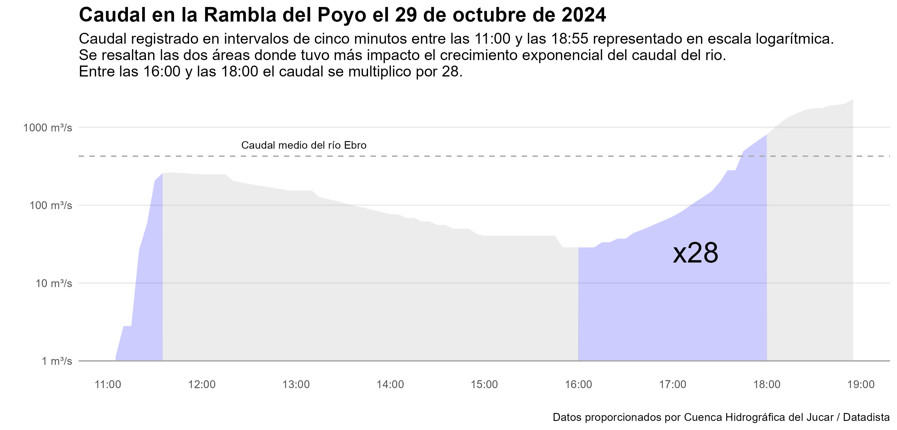
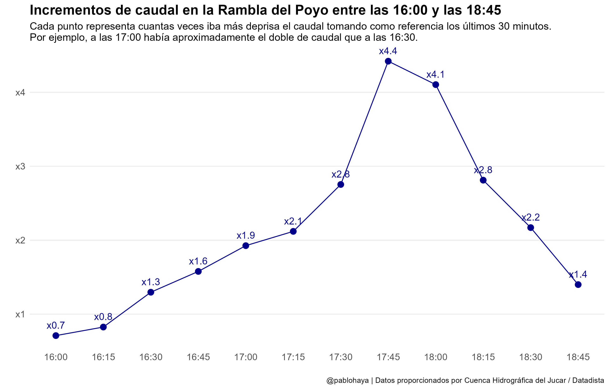

# El instinto lineal y su impacto en la interpretación de datos exponenciales

## «El instinto lineal»

En su libro _Factfulness_, el reconocido médico y experto en visualización de datos, Hans Rosling, reflexiona sobre la dificultad de reconocer patrones de crecimiento exponencial, incluso para quienes tienen una sólida formación en análisis de datos. Relata cómo, al igual que muchas personas, fue «demasiado lento para entender la magnitud y la urgencia de la crisis del Ébola», ya que inicialmente asumió que el incremento de los casos seguía una tendencia lineal cuando, en realidad, los datos indicaban un crecimiento exponencial. 

Esta experiencia resalta el impacto de un sesgo cognitivo que lleva a interpretar los datos bajo un supuesto de crecimiento lineal, lo cual dificulta la identificación de fenómenos que evolucionan de forma acelerada. Reconocer este sesgo resulta fundamental para enfrentar eficazmente problemas donde el crecimiento no sigue una tendencia lineal, sino que se intensifica rápidamente.

Ya [escribí](https://pablohaya.com/2020/03/27/por-que-es-tan-dificil-predecir-el-crecimiento-exponencial/) durante la pandemia como este "instinto lineal" nos llevó a subestimar el crecimiento de los contagios y lo complicado que es predecir en estos casos la evolución de un crecimiento exponencial. En la reciente catástrofe natural ocasionada por la DANA en la Comunidad Valenciana es probable que hayamos vuelto a pasar por alto el impacto de este crecimiento. 

## Caudal en la Rambla del Poyo

Las dos gráficas siguientes son el resultado de un análisis de cómo ha influido el crecimiento exponencial del caudal en la Rambla del Poyo durante el 29 de octubre de 2024. Los datos corresponden a los registros cinco minutales del caudal en la estación de aforo de la Rambla del Poyo recolectador por el [Sistema de Automático de Información Hidrológica](https://saih.chj.es) de la [Confederación Hidrológica del Jucar](https://www.chj.es) (CHJ). Estos datos fueron solicitados por [Antonio Delgado](https://x.com/adelgado) y compartidos el repositorio de [Datadista](https://github.com/datadista/datasets/tree/master/dana-valencia)

La primera gráfica muestra en escala logarítmica la evolución del caudal desde las 11:00 hasta las 18:55, que fue la última hora a la que se recibieron datos al arrasar el rio los instrumentos de medida. La escala logarítmica facilita el impacto del análisis del crecimiento exponencial del caudal, ya que el incremento del eje de las Y es exponencial, en vez de lineal. Cada marca se calcula multiplicando por $10$ la anterior. Así, la primera marca empieza en $1$ y la segunda salta a $10$, luego pasa $100$, finalmente a $1000$. 

Esta gráfica hay que interpretarla fijándonos cuando el caudal pasa de un marca a otra, por ejemplo, cuando el caudal se encuentra entre $10\ m^3/s$ y $100\ m^3/s$, y pasa a estar entre $100\ m^3/s$ y $1000\ m^3/s$, ya que durante este proceso terminamos multiplicando por $10$ o más el caudal. 

En la figura se resaltan dos momentos importantes. Al principio, cuando el caudal pasa por tres marcas, desde $1\ m^3/s$ hasta más de $100\ m^3/s$. Esta subida en tan poco tiempo fue enorme. Se multiplica el caudal por $100$ en $30$ minutos aproximadamente. La segunda es la franja entre las 16:00 y las 18:00 donde el caudal vuelve a crecer de manera exponencial ---el caudal sigue creciendo exponencialmente después de las 18:00 pero ya con muy poca capacidad de reacción---. Dentro de este intervalo, la Rambla del Poyo multiplicó por $28$ su caudal en dos horas ---paso de estar entre $10\ m^3/s$ y $100\ m^3/s$ a estar entre $100\ m^3/s$ y $1000\ m^3/s$---. 

La siguiente figura complementa la anterior. Aquí cada punto representa el incremento de caudal entre ese punto y el caudal que había 30 minutos antes. Por ejemplo, a las 17:00 había un caudal de $71.7\ m^3/s$ mientras que a las 16:30 el caudal era de $37.2\ m^3/s$, el incremento a las 17:00 es de $71.7/37.2 = 1.9$. La gráfica muestra el ascenso de estos incrementos desde las 16:30 hasta las 17:45, en el que alcanza el máximo, momento en el cual el rio iba a más de cuatro veces la medición que tuvo a las 17:15. A partir de este momento, aunque se desaceleran los incremento, el crecimiento del caudal sigue siendo exponencial multiplicándose entre por $1.5$ y por $3$ cada $30$ minutos.  

El Centro de Coordinación Operativo Integrado (CECOPI) se [reunió por primera vez a las 17:00](https://maldita.es/clima/20241105/rambla-poyo-correos-confederaci%C3%B3n-jucar-generalitat/). Desde la 16:00 el ritmo de crecimiento del caudal del río se estaba acelerando progresivamente ---una señal de que crecimiento podría ser exponencial---, pero todavía el caudal se mantenía por debajo del umbral del nivel 3 que se fija en $150\ m^3/s$ alerta. A las 17:30, el caudal no sólo superaba ese umbral sino que era manifiesto que el regimen de crecimiento era exponencial. A las 17:45, el crecimiento del caudal estaba completamente descontrolado y éste superaba ya el caudal medio del río Ebro. Según el [comunicado de la CHJ](https://x.com/CHJucar/status/1853529826692419854) declararón el escenario 0 a las 17:26, se pasó a escenario 1 a las 17:52, y escenario 2 ---que supone una situación excepcional--- a las 18:05, pero parece que se desprende del comunicado que estas declaraciones estaban relacionadas con el posible desbordamiento de la presa de Forata, no con la crecida de la Rambla del Poyo. No fue hasta las 18:43 cuando se recibió el aviso por correo electrónico de un caudal totalmente desmedido. A pesar de que todavía quedan [puntos importantes por esclarecer](https://maldita.es/clima/20241105/rambla-poyo-correos-confederaci%C3%B3n-jucar-generalitat/) me atrevería a afirmar que si hubiera detectado durante estas dos horas que el caudal del río estaba en crecimiento exponencial, se podría haber reaccionado mucho más rápido. 

## ¿Qué es el crecimiento exponencial?

Para entender con más detalle cómo opera el crecimiento exponencial voy a poner dos ejemplos. El primero, una historia clásica que lo ilustra de una forma magnífica. Según la leyenda, un rey agradecido prometió recompensar al sabio que había inventado el ajedrez. El sabio, humilde, pidió solo un grano de trigo en la primera casilla del tablero de ajedrez, el doble en la segunda (dos granos), el doble en la tercera (cuatro granos), y así sucesivamente hasta llenar las 64 casillas del tablero.

Al principio, la cantidad de granos parece manejable, pero debido al crecimiento exponencial, se vuelve inmensa. En la última casilla, la cantidad supera la capacidad de producción mundial de trigo, alcanzando cifras astronómicas: más de 18 trillones de granos. Serían necesarias las cosechas mundiales de 1195 años para sumar [esa cantidad de trigo](https://es.wikipedia.org/wiki/Problema_del_trigo_y_del_tablero_de_ajedrez).

Para el segundo ejemplo, imagina que tres naves parten hacia la Luna, a $384\,400$ kilómetros de la Tierra, cada una con una forma diferente de moverse. La primera nave viaja a velocidad constante, avanzando siempre a $10$ kilómetros por hora. A esta velocidad tardaría cerca de cuatro años en llegar. La segunda nave se mueve con una aceleración constante de $10\ km/s^2$. Comienza despacio, pero gana velocidad poco a poco y logra llegar en aproximadamente $11$ días y medio. Finalmente, la tercera nave avanza de forma exponencial multiplicando por $10\ km$ la distancia que recorre cada hora: su desplazamiento aumenta vertiginosamente, y en apenas seis horas ya ha alcanzado la Luna. Nuestro «instinto lineal» hace que pensemos en los incrementos de manera lineal, como la primera nave. En cambio, nos es muy complicado prever las implicaciones cuando el mundo se acelera, en particular cuando esa aceleración es exponencial. Como confiesa Rosling en _Factfulness_, «[...] una vez que entendí esto, actué. Pero hubiera deseado haber entendido y actuado antes».

## ¿Por qué es necesaria la escala logarítmica?

La escala logarítimica distorsiona la figura respecto a la gráfica que ha compartido Antonio Delgado en [la red social X](https://x.com/adelgado/status/1853840968736182772/photo/1) pero facilita el análisis del crecimiento exponencial. También publicó la CHJ una [gráfica](https://x.com/CHJucar/status/1853407411064730011) similar. De esta manera, podemos observar fenómenos que en las gráficas publicadas pueden pasar desapercibidos.

## Licencia

La documentación y gráficas de este sitio web, y cualquier versión del mismo que puedas encontrarte en otros formatos, es gratuito y se licencia bajo los términos y condiciones de [CC BY-SA 4.0](https://creativecommons.org/licenses/by-sa/4.0/deed.es). Puedes descargarte, compartir y adaptar los materiales de este sitio web siempre que mantengas la atribución al autor y los distribuyas con la misma licencia.

El código se rige por la licencia de código abierto [MIT](LICENSE).