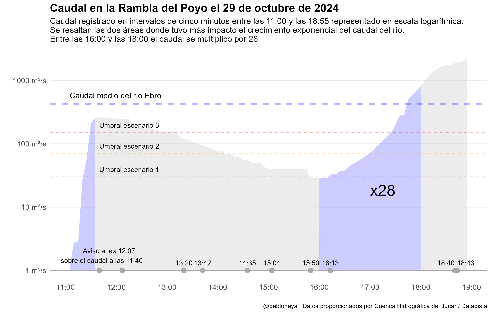

# Caudal en la Rambla del Poyo

En su libro _Factfulness_, el reconocido médico y experto en visualización de datos, Hans Rosling, reflexiona sobre la dificultad de reconocer patrones de crecimiento exponencial, incluso para quienes tienen una sólida formación en análisis de datos. Relata cómo, al igual que muchas personas, fue "demasiado lento para entender la magnitud y la urgencia de la crisis del Ébola", ya que inicialmente asumió que el incremento de los casos seguía una tendencia lineal cuando, en realidad, los datos indicaban un crecimiento exponencial. 

Esta experiencia resalta el impacto de un sesgo cognitivo que lleva a interpretar los datos bajo un supuesto de crecimiento lineal, lo cual dificulta la identificación de fenómenos que evolucionan de forma acelerada. Reconocer este sesgo resulta fundamental para enfrentar eficazmente problemas donde el crecimiento no sigue una tendencia lineal, sino que se intensifica rápidamente.

Ya [escribí](https://pablohaya.com/2020/03/27/por-que-es-tan-dificil-predecir-el-crecimiento-exponencial/) durante la pandemia como este "instinto lineal" nos llevó a subestimar el crecimiento de los contagios y lo complicado que es predecir en estos casos la evolución de un crecimiento exponencial. En la recien crisis climatológica es probable que hayamos vuelto a subestimar esta evolución. 

Las dos gráficas siguientes son el resultado de un análisis de cómo ha influido el crecimiento exponencial del caudal en la Rambla del Poyo durante el 29 de octubre de 2024. Los datos corresponden a los registros cinco minutales del caudal en la estación de aforo de la Rambla del Poyo recolectador por el [Sistema de Automático de Información Hidrológica](https://saih.chj.es) de la [Confederación Hidrológica del Jucar](https://www.chj.es) (CHJ). Estos datos fueron solicitados por [Antonio Delgado](https://x.com/adelgado) y compartidos el repositorio de [Datadista](https://github.com/datadista/datasets/tree/master/dana-valencia)

La primera gráfica muestra en escala logarítmica la evolución del caudal desde las 11:00 hasta las 19:00, que fue la última hora que se recibieron datos al arrasar el rio los instrumentos de medida. La escala logarítimica distorsiona la figura respecto a la gráfica que ha compartido Antonio Delgado en [X](https://x.com/adelgado/status/1853840968736182772/photo/1) pero facilita el análisis del crecimiento exponencial. También publicó la CHJ publicó una [gráfica](https://x.com/CHJucar/status/1853407411064730011) similar.

Cuando el eje se representa en escala logarítimica, el incremento del eje de las Y es exponencial, en vez de lineal. Cada marca se calcula multiplicando por $10$ la anterior. Así, la primer marca empieza en $1$ y la segunda salta a $10$. De este manera, podemos observar fenómenos que en las gráficas publicadas pueden pasar desapercibidos. Esta gráfica hay que interpretarla fijándonos cuando el caudal pasa de un marca a otra, por ejemplo, cuando está entre $10$ y $100$, y pasa a estar entre $100$ y $1000$, ya que durante este proceso terminamos multiplicando por $10$ en caudal. 

En la figura se resaltan dos momentos importantes. Al principio, cuando el caudal pasa por tres marcas, desde $1\ m^3/s$ hasta más de $100\ m^3/s$. Esta subida en tan poco tiempo es enorme. Se multiplica el caudal por $100$ en $30$ minutos aproximadamente. La segunda es la franja entre las 16:00 y las 18:00 donde el caudal vuelve a crecer de manera exponencial ---el caudal sigue creciendo exponencialmente después de las 18:00 pero ya con muy poca capacidad de reacción---. Dentro de este intervalo, la Rambla del Poyo multiplicó por $28$ su caudal en dos horas ---paso de una marca---. Este es el tramo más crítico en hay que detectar que el caudal del río estaba en crecimiento exponencial para poder reaccionar rápido. 

La siguiente figura complementa la anterior. Aquí cada punto representa el incremento de caudal entre ese punto y el que había 30 minutos antes. Por ejemplo, a las 17:00 había un caudal de $71.7\ m^3/s$ mientras que a las 16:30 el caudal era de $37.2\ m^3/s$, el incremento a las 17:00 es de $71.7/37.2 = 1.9$. La gráfica muestra el ascenso de estos incrementos desde las 16:30 hasta las 17:45, en el que alcanza el máximo, momento en el cual el rio iba a más de cuatro veces la medición que tuvo a las 17:15. A partir de este momento, aunque se desaceleran los incremento, el crecimiento del caudal sigue siendo exponencial multiplicándose entre por $1.5$ y por $3$ cada $30$ minutos.  

## Licencia

La documentación y gráficas de este sitio web, y cualquier versión del mismo que puedas encontrarte en otros formatos, es gratuito y se licencia bajo los términos y condiciones de [CC BY-SA 4.0](https://creativecommons.org/licenses/by-sa/4.0/deed.es). Puedes descargarte, compartir y adaptar los materiales de este sitio web siempre que mantengas la atribución al autor y los distribuyas con la misma licencia.

El código se rige por la licencia de código abierto [MIT](LICENSE)